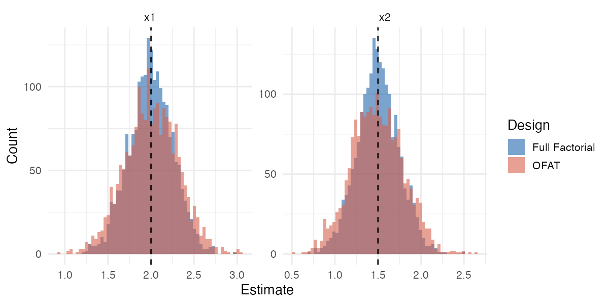
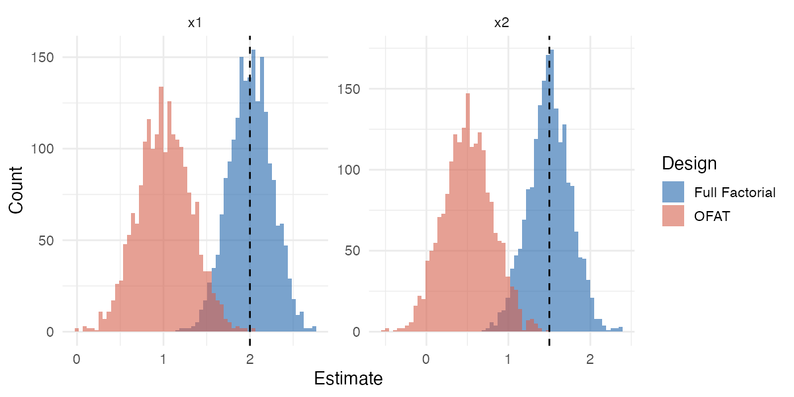
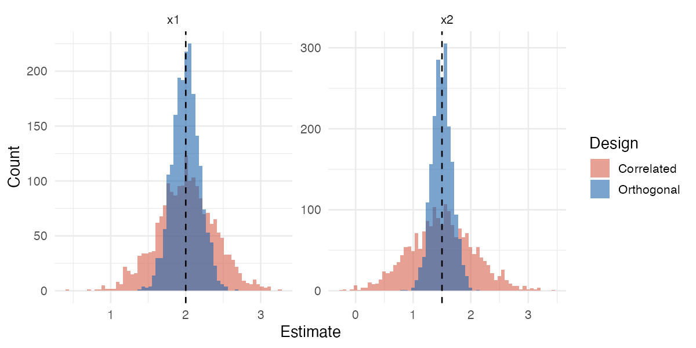
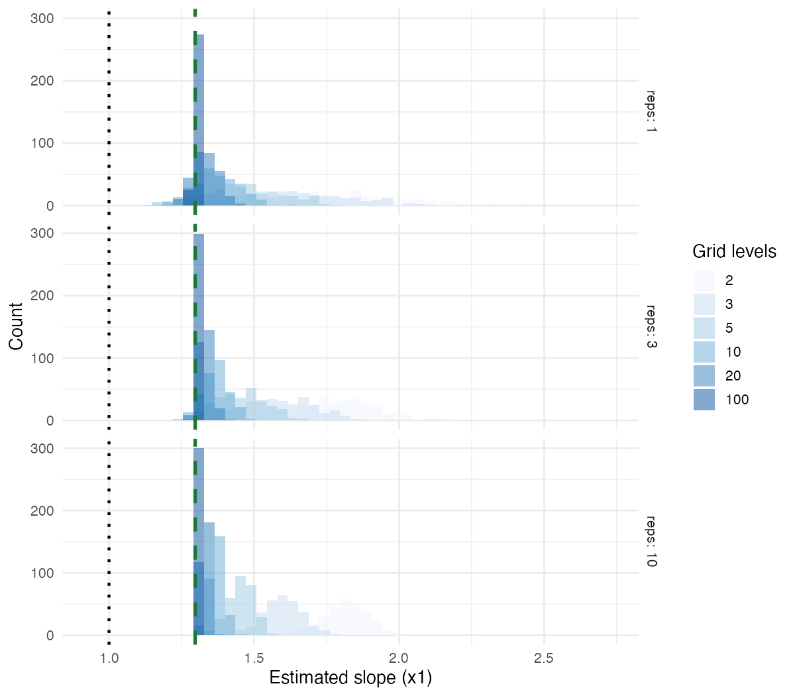

### 1. Introduction

Ordinary Least Squares (OLS) is one of the most foundational ideas in statistics. Given observations $y_1, \dots, y_n$ at design points $x_1, \dots, x_n$, OLS finds the coefficient vector $\hat{\beta}$ that minimizes the sum of squared residuals:

$$\hat{\beta} = \arg\min_{\beta} \sum_{i=1}^n \left[ y_i - x_i^\top \beta \right]^2$$

Its ubiquity stems from a compelling combination of simplicity, minimal assumptions, and computational efficiency. And even when its assumptions are not exactly met, OLS tends to yield reasonable results. These properties make it a natural starting point for any statistical analysis.

This post examines OLS in the context of experimental design. How well OLS performs depends critically on the experiment that produced the data. The choice of design points, how many times, and in what combination determines what can be estimated at all, how precisely, and what the estimates actually mean. This post examines the many design choices; what they cost and buy.

### 2. Setup

Let $\mathcal{X} \subseteq \mathbb{R}^k$ be the experimental space. A **design** $\mathcal{D}$ is a finite multiset of $n$ points in $\mathcal{X}$:

$$\mathcal{D} = \\{x_1, x_2, \dots, x_n\\} \subseteq \mathcal{X}$$

allowing replication. The basic set-up of OLS can be extended to fit a linear model $y = f(x)^\top \beta + \epsilon$, where $f : \mathcal{X} \to \mathbb{R}^p$ is a fixed vector of basis functions and $\epsilon \sim (0, \sigma^2)$. The **design matrix** $X \in \mathbb{R}^{n \times p}$ has $i$-th row $f(x_i)^\top$. Solving the minimization above gives $\hat{\beta} = (X^\top X)^{-1} X^\top y$ whenever $X^\top X$ is invertible.

As an example of typical basis functions: consider $\mathcal{X} \subseteq \mathbb{R}^2$ with $f:\mathcal{X}\to\mathbb{R}^4$ given by 

$$f\left(x\right) = \begin{pmatrix} 1 \\\ x_1 \\\ x_2 \\\ x_1x_2\end{pmatrix}$$

This framework allows for intercepts, and so-called "interaction terms", but is even more general than that.

Everything of statistical interest flows from the **Gram matrix** $G = X^\top X$. 

Note: my notation is slightly overloaded. Somtimes $x_i$ denotes the $i$-th observation in the design and other times $x_i$ denotes the the $i$-th component of a single observation. It should be clear from context which is meant.

#### Definitions

***Definition (Orthogonality).*** The design $\mathcal{D}$ is **orthogonal** if $G = X^\top X$ is a diagonal matrix. Equivalently, every pair of distinct basis functions $f_j$ and $f_k$ satisfies

$$\sum_{i=1}^n f_j(x_i) \\, f_k(x_i) = 0$$

This condition is stated entirely in terms of the basis functions evaluated at the design points, and imposes no restriction on the number of levels of any factor.

***Definition (Balance).*** For a single factor $x_j$ taking values in a finite set of levels $\mathcal{L}_j$, the design is **balanced in $x_j$** if each level appears the same number of times:

$$|\\{i : x_{ij} = \ell\\}| = \frac{n}{|\mathcal{L}_j|} \quad \text{for all } \ell \in \mathcal{L}_j$$

The design is **balanced** if it is balanced in every factor. Balance is a marginal condition: it says each factor's own levels appear equally often, but says nothing about how factor levels co-occur across factors. 

***Definition (Support).*** The **support** of $\mathcal{D}$ is $\mathrm{supp}(\mathcal{D}) = \\{x_1, \dots, x_n\\} \subseteq \mathcal{X}$ as a set. The design has **full support** for model $f$ if $G = X^\top X$ is invertible or equivalently, if no nonzero $\beta$ satisfies $f(x_i)^\top \beta = 0$ for all $x_i \in \mathrm{supp}(\mathcal{D})$.

When $G$ is singular, some linear combination of the basis functions cannot be distinguished from zero on the observed points, and the corresponding coefficients are not identifiable.

#### A Concrete Example

Consider two-level factors $x_1, x_2 \in \\{-1, +1\\}$ and the model $f(x) = (1, x_1, x_2, x_1 x_2)^\top$. The **full factorial** design runs all four combinations once:

$$\mathcal{D}_{\mathrm{FF}} = \\{(-1,-1),\\, (+1,-1),\\, (-1,+1),\\, (+1,+1)\\}$$

The design matrix and Gram matrix are:

$$X = \begin{pmatrix} 1 & -1 & -1 & 1 \\\ 1 & 1 & -1 & -1 \\\ 1 & -1 & 1 & -1 \\\ 1 & 1 & 1 & 1 \end{pmatrix}, \qquad G = X^\top X = \begin{pmatrix} 4 & 0 & 0 & 0 \\\ 0 & 4 & 0 & 0 \\\ 0 & 0 & 4 & 0 \\\ 0 & 0 & 0 & 4 \end{pmatrix} = 4I$$

$G$ is diagonal, so this design is orthogonal. It is also balanced: each level of $x_1$ and $x_2$ appears exactly twice, and the design visits all four cells, giving it full support for the model.

Now consider instead an **unbalanced** design that replicates the $(-1,-1)$ corner:

$$\mathcal{D}_{\mathrm{UB}} = \\{(-1,-1),\\, (-1,-1),\\, (+1,-1),\\, (+1,+1)\\}$$

$$X = \begin{pmatrix} 1 & -1 & -1 & 1 \\\ 1 & -1 & -1 & 1 \\\ 1 & 1 & -1 & -1 \\\ 1 & 1 & 1 & 1 \end{pmatrix}, \qquad G = X^\top X = \begin{pmatrix} 4 & 0 & -2 & 0 \\\ 0 & 4 & 0 & -2 \\\ -2 & 0 & 4 & 0 \\\ 0 & -2 & 0 & 4 \end{pmatrix}$$

$G$ is no longer diagonal so this design is not orthogonal. The $(-1,+1)$ cell is also missing, so this design does not have full support for the interaction. Each design choice (which points to run, how many times) has immediate and concrete consequences for the structure of $G$.

#### Factors with More Than Two Levels, and the Role of Coding

A factor with $\ell_i > 2$ levels contributes $\ell_i - 1$ columns to the design matrix (one per degree of freedom, not one per level). The particular columns chosen form a **coding** of the factor, and it is worth being precise about what the coding affects and what it does not.

The coding determines: (a) which contrasts are readable directly as coefficients, and (b) the diagonal entries of $G$. It does *not* affect the column subspace spanned by a given factor's columns, the fitted values and residuals, overall factor F-tests, or whether the off-diagonal blocks of $G$ between different factors are zero. Orthogonality between factors is a property of the design and the subspaces, it does not depend on which basis was chosen within each subspace.

For **categorical factors** (unordered levels, such as treatment types or geographic regions), any full-rank coding spanning the $(\ell_i - 1)$-dimensional contrast subspace gives identical fitted values $\hat{y}$, residual sums of squares, and F-tests. An **orthogonal contrast coding** additionally requires the $\ell_i - 1$ columns to be mutually orthogonal and sum to zero across a balanced design. This is the coding that matters for between-factor orthogonality: when every factor uses orthogonal contrasts, the off-diagonal blocks of $G$ between distinct factors are guaranteed to be zero by the equal-replication structure of a full factorial.

For **numerical factors** (levels are real numbers with intrinsic spacing, such as dose or temperature), the columns of $X$ contain the actual numeric values and their powers or other basis functions, so the spacing of levels enters $G$ directly. Equal spacing is the conventional choice because it yields standard orthogonal polynomial contrasts with a clean closed form.  Unequal spacing does not prevent orthogonality, but the orthogonal polynomials must then be constructed via Gram–Schmidt and are specific to the chosen levels, with no closed-form shortcut.

Together, these cases share a common structure: orthogonality within a factor is achieved by choosing columns that are mutually orthogonal and sum to zero, and orthogonality between factors follows from equal replication across their joint levels.

---

### 3. Support: The Prerequisite for Identifiability

Orthogonality governs efficiency; support governs validity. Before asking whether estimates are precise, we must ask whether they exist at all. A design can be balanced in every factor yet still fail to identify the parameters of interest if it does not visit the right regions of $\mathcal{X}$.

#### What Goes Wrong Without Adequate Support

The failure mode is a singular Gram matrix: some linear combination of the basis functions evaluates to zero at every support point, making the corresponding parameter unrecoverable. Replication at existing points cannot help. The issue is geometric, not a matter of sample size.

**Example (OFAT non-identifiability).** *Let $f(x) = (1, x_1, x_2, x_1 x_2)^\top$ and consider the One-Factor-at-a-Time (OFAT) design*

*$$\mathcal{D}_{\mathrm{OFAT}} = \\{(-1,-1),\\, (1,-1),\\, (-1,-1),\\, (-1,1)\\}$$*

*(with $(-1,-1)$ replicated twice). Then $G = X^\top X$ is singular: the interaction $x_1 x_2$ is not identifiable.*

**Proof.** Despite $n = 4$ observations, the design has only three distinct support points: $\\{(-1,-1), (1,-1), (-1,1)\\}$. Evaluate the four columns of $X$ on these three points:

$$\text{intercept}: \begin{pmatrix}1\\\1\\\1\end{pmatrix}, \quad x_1: \begin{pmatrix}-1\\\1\\\ -1\end{pmatrix}, \quad x_2: \begin{pmatrix}-1\\\ -1\\\1\end{pmatrix}, \quad x_1x_2: \begin{pmatrix}1\\\\ -1\\\ -1\end{pmatrix}$$

The sum of all four columns is $(1,1,1)^\top + (-1,1,-1)^\top + (-1,-1,1)^\top + (1,-1,-1)^\top = (0,0,0)^\top$. The four columns sum to zero, an exact linear dependency. Therefore $\mathrm{rank}(X) \leq 3 < 4$ and $G$ is singular. $\square$

The root cause is geometric: OFAT varies one factor at a time from a fixed baseline, so it never simultaneously places both factors at $+1$. The cell $(+1,+1)$ is never visited. With only three distinct support points, four linearly independent functions cannot be distinguished. This failure is not a feature of the $\\{-1,+1\\}$ coding: any OFAT design over any factor levels varies one factor at a time from a fixed baseline, so it misses the off-diagonal cells of the factor grid and suffers the same rank deficiency for the same geometric reason.

#### The Consequence: Bias, Not Imprecision

A subtle but important point: when support fails, the damage is not wider confidence intervals but biased estimates of whatever *is* estimable. Because the interaction is aliased with the main effects, OLS has no choice but to absorb its contribution into the coefficients it can estimate. This is, in my opinion, the biggest danger of OFAT designs.

**Figure 1.** When the true model is additive (no interaction), OFAT and a full factorial design both recover the correct slope estimates with similar variance. Both designs have adequate support for the additive model.

**Figure 2.** When an interaction is present, OFAT produces biased estimates of the main effects. Because the interaction is not identifiable, OLS absorbs it into the main effects. The full factorial estimates both main effects and the interaction without bias.

---

### 4. Orthogonality: Independence and Efficiency

Given adequate support, the next question is how precisely we can estimate the parameters, and whether the estimates interact with each other. These are the concerns of orthogonality.

#### What Goes Wrong Without Orthogonality

When $G$ has nonzero off-diagonal entries, two things happen simultaneously. First, the estimators $\hat\beta_j$ and $\hat\beta_k$ are statistically entangled: knowing one tells you something about the other, even before seeing the data. Second, variance inflates beyond what the raw information content of the experiment would suggest.

The entanglement is not merely aesthetic. It means that the reported effect of one factor depends implicitly on what values were assigned to others. An experiment designed to isolate the effect of $x_1$ will, if $G$ is non-diagonal, produce an estimate of $\beta_1$ that is contaminated by the effects of $x_2, x_3, \dots$ 

**Theorem 1.** *If $\mathcal{D}$ is orthogonal, then $\mathrm{Cov}(\hat{\beta}_j, \hat{\beta}_k) = 0$ for all $j \neq k$. Under Gaussian noise, the estimates are independent.*

**Proof.** The covariance matrix of the OLS estimator is $\mathrm{Cov}(\hat{\beta}) = \sigma^2 G^{-1}$. When $G$ is diagonal, so is $G^{-1}$, and $(G^{-1})_{jk} = 0$ for $j \neq k$. Zero covariance under Gaussian noise implies independence. $\square$

This means the estimate of one factor's effect does not depend on what values we assigned to another — each coefficient can be read off without reference to the rest of the model.

**Theorem 2.** *For any fixed design with $G_{jj}$ held constant, the variance of $\hat{\beta}_j$ is minimized if and only if the $j$-th column of $X$ is orthogonal to all other columns.*

**Proof.** By the Schur complement, for any positive-definite matrix $G$:

$$(G^{-1})\_{jj} = \frac{1}{G\_{jj} - g_j^\top G_{-j}^{-1} g_j} \geq \frac{1}{G_{jj}}$$

where $g_j$ is the off-diagonal vector and $G_{-j}$ is $G$ with the $j$-th row and column removed. The lower bound $1/G_{jj}$ is achieved if and only if $g_j = 0$. Since $\mathrm{Var}(\hat{\beta}\_j) = \sigma^2 (G^{-1})\_{jj}$, any correlation between $f_j$ and the other basis functions **strictly** inflates the variance of $\hat{\beta}_j$. $\square$

In the unbalanced example from Section 2, the off-diagonal $-2$ entries in $G$ mean that the intercept and $x_2$ estimates are entangled: knowing one tells you something about the other, and both are estimated less precisely than they would be under the full factorial.

**Figure 3.** Two designs each covering the full factorial space: one orthogonal (replicated full factorial), one with correlated predictors (points clustered along a diagonal). Both are centered on the true parameter values, but the correlated design produces substantially wider sampling distributions.

This illustrates Theorem 2 concretely: removing the off-diagonal mass from $G$ tightens the $(G^{-1})_{jj}$ bound, reducing variance without affecting the expectation.

#### Full Factorial Designs are Orthogonal

The full factorial design is orthogonal, and the proof reveals exactly why: the equal-replication structure guarantees that every pair of basis functions cancels. The result holds for factors with any number of levels, as long as orthogonal contrast coding is used.

**Theorem 3 (Full factorial implies orthogonality).** *Let $\mathcal{D}$ be a full factorial design over factors $x_1, \dots, x_k$, each taking $\ell_j \geq 2$ levels, with every combination of levels appearing an equal number of times. Suppose each factor is encoded using orthogonal contrasts: a set of $\ell_j - 1$ columns that are mutually orthogonal and each sum to zero across the balanced marginal distribution of that factor. Then the design is orthogonal.*

**Proof.** It suffices to show that any two distinct basis functions $f_j$ and $f_k$ have zero inner product across $\mathcal{D}$. Since the functions involve different sets of factors, there exists at least one factor $x_r$ that contributes to one function but not the other. Because $\mathcal{D}$ is a full factorial with equal replication, for every fixed assignment of all remaining factors, the values of $x_r$ cycle through all of its $\ell_r$ levels equally often. The inner product $\sum_i f_j(x_i) f_k(x_i)$ therefore factors as a product of sums, one of which runs over the contrast values of $x_r$ against a constant. By the zero-sum property of orthogonal contrasts, this sum is zero, so the entire inner product is zero.

For two-level factors coded $\{-1, +1\}$, this reduces to a clean pairing argument: every design point $x_i$ has a partner $x_i'$ differing only in the sign of $x_r$, and the two contributions cancel because flipping $x_r$ changes the sign of whichever function involves it but not the other. The generalization to $\ell_r$ levels replaces pairwise cancellation with a sum over all $\ell_r$ contrast values of $x_r$, which is zero by construction. $\square$

---

### 5. Balance: Power and Interpretability

#### Lack of Balance Does Not Affect the Estimand Under Correct Specification

A subtle but easily overlooked fact is that, provided the model is correctly specified and $G$ is invertible (i.e. we have full coverage), the design influences only the *variance* of $\hat{\beta}$, not its expectation. No matter how the design points are distributed, OLS remains unbiased for $\beta^\*$.

This runs against a natural intuition. An unbalanced design may heavily over-sample one region of the design space, suggesting that the resulting estimates should be pulled in that direction. In fact, this does not happen: under correct specification, the estimand is invariant to the design. What changes is not the target, but the precision with which it is estimated.

**Theorem 4 (Design-invariance of OLS under correct specification).** *Suppose the true data-generating process satisfies $y_i = f(x_i)^\top \beta^\* + \epsilon_i$ with $\mathbb{E}[\epsilon_i] = 0$. Then for any design $\mathcal{D}$ such that $G = X^\top X$ is invertible,*

*$$\mathbb{E}[\hat\beta] = \beta^\*$$*

*regardless of which points $x_1, \dots, x_n$ were chosen.*

**Proof.** The OLS estimator satisfies

$$\hat\beta = (X^\top X)^{-1} X^\top y = (X^\top X)^{-1} X^\top (X\beta^* + \epsilon) =
\beta^* + (X^\top X)^{-1} X^\top \epsilon$$

Taking expectations and using $\mathbb{E}[\epsilon] = 0$:

$$\mathbb{E}[\hat\beta] = \beta^* + (X^\top X)^{-1} X^\top \mathbb{E}[\epsilon] = \beta^*$$

The matrix $(X^\top X)^{-1} X^\top$ depends on the design, but it multiplies a zero vector, and so vanishes. $\square$

Under correct specification, a wildly unbalanced design and an elegant orthogonal factorial both target the same $\beta^*$; the orthogonal design simply does so with less variance. The estimand is fixed the moment the model is correctly specified. What good design buys is a tighter distribution around that fixed target.

#### Lack of Balance Reduces Statistical Power for Contrasts

While balance does not affect the estimand, it does affect how precisely individual level means are estimated (and therefore the power of statistical tests that compare them).

Suppose factor $x_j$ takes levels $\mathcal{L}\_j = \\{\ell\_1, \ell\_2\\}$ and we wish to test the contrast $\beta\_{\ell\_1} - \beta\_{\ell\_2}$. Let $n_1$ and $n_2 = n - n_1$ be the number of observations at each level. The variance of the contrast estimator (assuming an orthogonal design) is

$$\mathrm{Var}(\hat\beta_{\ell_1} - \hat\beta_{\ell_2}) = \sigma^2\left(\frac{1}{n_1} +
\frac{1}{n_2}\right)$$

This is minimized when $n_1 = n_2 = n/2$, i.e., when the design is balanced in $x_j$. Any departure from equal replication inflates this variance,  and inflated variance means reduced power for the $t$-test of the contrast. The arithmetic-harmonic mean inequality makes this precise: for fixed $n$,

$$\frac{1}{n_1} + \frac{1}{n_2} \geq \frac{4}{n}$$

with equality if and only if $n_1 = n_2$. The same argument extends to contrasts among $|\mathcal{L}_j|$ levels: the variance of any pairwise comparison is minimized when all levels are equally replicated. The practical consequence is that an imbalanced design may fail to detect a true effect not because the effect is absent, but because the test has insufficient power to see it.

---

### 6. Misspecification: What OLS Actually Estimates — and What It Means

The preceding sections assumed the model is correctly specified but this assumption is almost never exactly true. What happens when the true data-generating process $g(x)$ lies outside the model space spanned by $f$?

#### OLS as Projection Under the Empirical Measure

For any fixed design $\mathcal{D}$ with empirical measure $\xi_n = \frac{1}{n} \sum_{i=1}^n \delta_{x_i}$, the OLS objective can be written as

$$\hat{\mathcal{R}}(\beta) = \frac{1}{n} \sum_{i=1}^n \left[ g(x_i) - f(x_i)^\top \beta \right]^2 = \int \left[ g(x) - f(x)^\top \beta \right]^2 d\xi_n(x)$$

**Theorem 5 (OLS as $L^2$ projection).** *For any design $\mathcal{D}$, the OLS estimator $\hat{\beta}$ satisfies*

$$\hat{\beta} = \arg\min_{\beta} \int \left[ g(x) - f(x)^\top \beta \right]^2 d\xi_n(x)$$

*This is the best approximation to $g$ in the model space under the $L^2(\xi_n)$ inner product.*

**Proof.** Setting the gradient of $\hat{\mathcal{R}}(\beta)$ to zero gives $\frac{1}{n} G \hat{\beta} = \frac{1}{n} X^\top g$, i.e., the standard OLS normal equations $G\hat{\beta} = X^\top g$. The solution is the $L^2(\xi_n)$-projection of $g$ onto the model space. $\square$

The key consequence: **the slope you report is not a property of $g$ alone; it is a property of the interaction between $g$ and your design.** Change $\xi_n$ (by changing which points you sample, or how many times) and you change the quantity you are estimating. This is precisely the contrast with Theorem 4: under correct specification, changing the design changes $(X^\top X)^{-1}$ but the $(X^\top X)^{-1}X^\top \epsilon$ term vanishes in expectation, leaving $\beta^\*$ unchanged. Under misspecification, there is no such $\beta^\*$ waiting to be recovered: the target is $\beta^\*(\xi_n) = \arg\min_\beta \int [g - f^\top\beta]^2 d\xi_n$, which is a functional of both $g$ and $\xi_n$ simultaneously.

As a design grows (more levels, finer grids), $\xi_n$ converges to some limiting distribution $\xi$, and $\hat{\beta}$ converges to the $L^2(\xi)$-projection of $g$. A uniform grid over $[-1,1]$ converges to a uniform $\xi$; a design clustered near zero converges to a distribution concentrated there, giving an estimate close to the local derivative.

**Figure 4.** The true DGP is $g(x_1, x_2) = e^{x_1 + x_2}$, fitted with a linear model. As the grid becomes finer (more levels), OLS converges toward a fixed value (the best linear $L^2$ approximation under the uniform distribution over $[-1,1]^2$). Increasing replication at a fixed grid reduces variance but does not change the target. The dotted line is the true derivative at zero ($= 1.0$); the dashed green line is the analytic $L^2$ projection limit ($\approx 1.297$).

#### The Interpretability Problem

In a correctly specified linear model, the coefficient $\hat\beta_j$ has a clean interpretation: the expected change in $y$ per unit change in $x_j$, holding all other predictors fixed. This interpretation is unambiguous because it is a property of $g$ itself and it does not depend on which points we happened to observe.

Under misspecification, this interpretation collapses. The coefficient is no longer a fact about the world; it is a fact about the world *as probed by the experiment*. More precisely, it is the weight assigned to $f_j$ in the $L^2(\xi_n)$-best linear approximation to $g$. This weight depends on $\xi_n$: if you ran the same experiment with the same underlying $g$ but concentrated observations near the origin instead of spreading them uniformly, you would recover a different $\hat\beta_j$ (and both values would be correct answers to different questions).

What question, exactly? The coefficient $\hat\beta_j$ answers: "If I had to predict $g(x)$ using only a linear function of $x$, and I cared about prediction error averaged over the distribution $\xi_n$, what weight should I place on $x_j$?" That is a perfectly well-defined question. It just is not the same as "what is the marginal effect of $x_j$?" unless $g$ is linear, in which case the two coincide, recovering Theorem 4. $\hat\beta_j$ can also be thought of as the average slope (or average linear effect) of $x_j$ over the design region as weighted by the replication of the design.

#### Balance, Imbalance, and What the Estimand Represents

Under correct specification, an imbalanced design is merely less efficient: Theorem 4 guarantees the estimand is still $\beta^*$, and Theorem 2 says variance will be inflated relative to an orthogonal design. But the target is the same.

Under misspecification, imbalance has a second effect: it changes what is being estimated. An unbalanced design concentrates $\xi_n$ unevenly over the design space, so the $L^2(\xi_n)$-projection of $g$ is a non-uniformly weighted average slope. A balanced design makes $\xi_n$ uniform over the factor space (in the marginal sense), so the estimated coefficients reflect average effects over the experimental region rather than effects weighted by the accident of sample composition. This is the deepest reason to prefer balanced designs in practice: not that they are necessary for unbiasedness (they are not, under correct specification), but that they make the estimand's interpretation robust to mild misspecification. If the true model is slightly nonlinear, a balanced design estimates something close to the average slope; an imbalanced design estimates something close to the slope in the overrepresented region. (Note that if data is properly sampled from a population and the observed points are "naturally unbalanced", then this is a good thing and we shouldn't try to correct it with uniform weights).

#### Design Density as a Choice About What to Measure

This reframes the practical significance of design density. It is not merely a matter of statistical efficiency but a choice about which summary of $g$ to target.

A narrow design concentrated near a point $x_0$ makes $\xi_n$ concentrate near $x_0$, and the resulting $\hat\beta$ approximates the Taylor coefficient of $g$ at $x_0$. That is to say, as the design narrows, the linear fit converges to the tangent plane, and the coefficient recovers its familiar causal interpretation (at least locally).

A wide design spread over a large region of $\mathcal{X}$ makes $\xi_n$ diffuse, and $\hat\beta$ becomes a global average slope: a weighted integral of the gradient of $g$ over the design region. This is a meaningful quantity (it describes how much $g$ varies on average across the space), but it is not the local derivative at any particular point, and it may be quite far from it when $g$ is strongly nonlinear.

There is no design-free "slope" when $g$ is nonlinear, there is only a design-dependent summary of the relationship. The practical upshot is that choosing a design is inseparable from choosing what quantity to estimate. Wide designs give global average effects; narrow designs give local effects; neither is right or wrong in the abstract, only relative to the scientific question being asked.

A corollary worth stating explicitly: **replication does not rescue a misspecified model.** More observations at the same design points reduces $\mathrm{Var}(\hat\beta)$ but does not change the target $\beta^*(\xi_n)$ being estimated. If $\beta^\*(\xi_n)$ is not the quantity of scientific interest, then precision is of limited consolation. The fix, is changing the design, not accumulating more data under the current one.

---

### 7. Conclusion

The central lesson of this post is that a design is not merely a sampling plan but a choice about what to measure.

Under correct specification, this choice is forgiving. Theorem 4 guarantees that OLS targets the true $\beta^\*$ regardless of where observations are placed; the design affects only variance, never the estimand. This is the regime in which support and orthogonality do their work: support is the prerequisite for identifiability, and orthogonality achieves the minimum possible variance for each coefficient while keeping estimates statistically independent. Together they characterize what a good design looks like when the model is right.

Under misspecification (the more realistic case) the situation is fundamentally different. OLS finds the best linear approximation to $g$ under the empirical measure $\xi_n$ of design points, but this target is a functional of both $g$ and $\xi_n$. Change the design and you change what you are estimating, not just how precisely. A design concentrated near a point estimates something close to a local derivative; one spread over a wide region estimates a global average slope. Neither is wrong, but they answer different questions, and comparing results across designs as if they measure the same thing is a category error.

This is also why balance matters beyond efficiency. A balanced design makes $\xi_n$ uniform over the experimental region, so the estimated coefficients represent average effects in a clean, design-invariant sense. An imbalanced design skews $\xi_n$, and the resulting coefficients reflect slopes in the overrepresented region,  which may not be the region of scientific interest.

The main takeway: before asking how precisely an experiment answers a question, it is worth asking which question it actually answers. Coverage of the relevant design space is often more important than efficiency within a narrow region. And replication, however abundant, cannot fix a design that is probing the wrong part of $\mathcal{X}$.

Thanks for reading!
