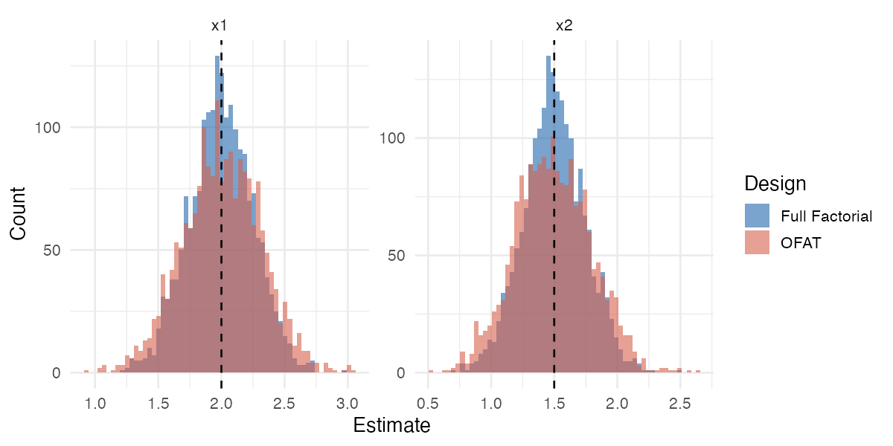
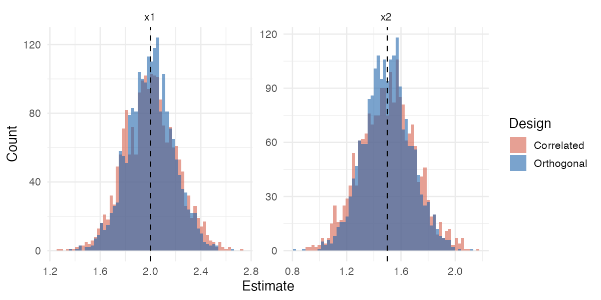
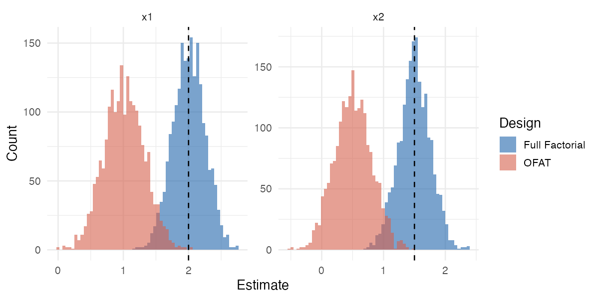
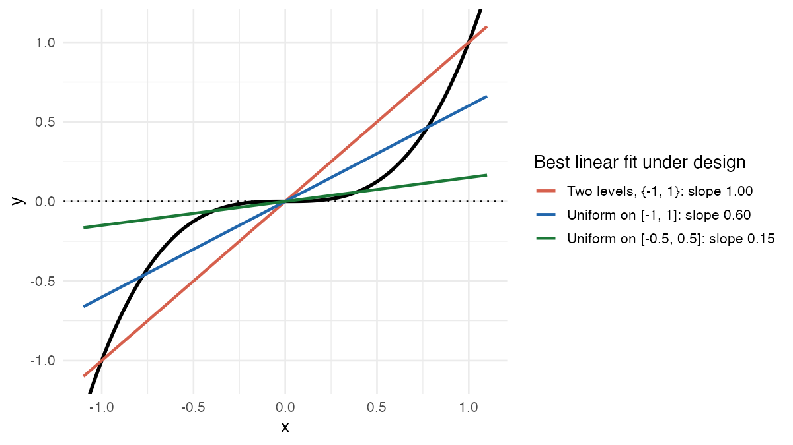
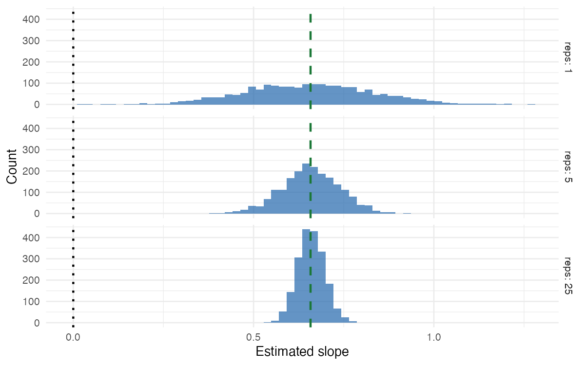

### The question

Ordinary least squares (OLS) takes observations $y_1, \dots, y_n$ at design points $x_1, \dots, x_n$ and finds the coefficients that minimize squared error. The design points are your choice: which to run, and how often. What does that choice accomplish?

It depends on whether the model is right.

- **Well-specified model:** design affects *identifiability* and *variance*. It never affects what you are estimating.
- **Misspecified model:** design determines *what you are estimating*.

I used to think misspecification was mostly harmless. If the truth is nonlinear, I figured, a linear fit is at least a first-order Taylor approximation, so the slope is roughly the derivative. It isn't. The slope is a design-dependent average, and a different design gives a different answer. Section 2 shows this with a cubic.

### Setup

A **design** is a multiset of $n$ points $x_1, \dots, x_n$ in an experimental space $\mathcal{X}$. The model is $y = f(x)^\top \beta + \epsilon$, where $f : \mathcal{X} \to \mathbb{R}^p$ is a fixed vector of basis functions and the errors have mean zero, variance $\sigma^2$, and are uncorrelated. The **design matrix** $X \in \mathbb{R}^{n \times p}$ has rows $f(x_i)^\top$, and the **Gram matrix** is $G = X^\top X$. Then

$$\hat\beta = G^{-1} X^\top y, \qquad \mathrm{Cov}(\hat\beta) = \sigma^2 G^{-1}.$$

Running example: two factors $x_1, x_2 \in \\{-1, +1\\}$ and $f(x) = (1, x_1, x_2, x_1 x_2)^\top$ (intercept, main effects, interaction). The **full factorial** design runs all four combinations once, and gives $G = 4I$.

Three properties of a design matter:

- **Support.** The design has full support for $f$ if $G$ is invertible. Equivalently, no nonzero $\beta$ has $f(x_i)^\top \beta = 0$ at every design point.
- **Orthogonality.** $G$ is diagonal: distinct basis functions satisfy $\sum_i f_j(x_i) f_k(x_i) = 0$.
- **Balance.** Each level of each factor appears equally often. This is a marginal condition and says nothing about how levels co-occur across factors.

(A factor with $\ell > 2$ levels uses $\ell - 1$ columns. Orthogonal contrasts, meaning columns that are mutually orthogonal and sum to zero, play the role of $\pm 1$.)

**Theorem 1.** *A full factorial design over two-level factors coded $\pm 1$, with every combination replicated equally, is orthogonal.*

*Proof.* The basis functions are monomials in the $x_j$. Take two distinct ones. Some factor $x_r$ appears in exactly one of them. Pair each design point with its partner that differs only in the sign of $x_r$. The partner's contribution to $\sum_i f_j(x_i) f_k(x_i)$ is the negative of the point's own. All terms cancel. $\square$

### 1. When the model is correct

Suppose $y = f(x)^\top \beta^\* + \epsilon$. Then $\hat\beta = \beta^\* + G^{-1}X^\top\epsilon$, so

$$\mathbb{E}[\hat\beta] = \beta^\*$$

for **every** design with $G$ invertible. The target never moves. Design acts only through $G^{-1}$, and so only on variance.

#### Support: can you estimate it at all?

If $G$ is singular, some combination of basis functions vanishes at every design point and the corresponding parameter is not identifiable. Replication cannot fix this.

The classic case is one-factor-at-a-time (OFAT): start at a baseline and vary one factor at a time.

$$\mathcal{D}\_{\mathrm{OFAT}} = \\{(-1,-1),\\, (1,-1),\\, (-1,-1),\\, (-1,1)\\}$$

This has $n = 4$ runs but only three distinct points, and the cell $(+1,+1)$ is never visited. On those three points, $x_1 x_2 = -1 - x_1 - x_2$. The interaction column is a linear combination of the others, so $G$ is singular and the interaction cannot be estimated. The same happens for any OFAT design: it never moves two factors off baseline at once.

Even when OFAT is enough, it is less efficient. If the truth is additive, both designs are unbiased, but OFAT's slope estimates are noisier. For the additive model, $(G^{-1})\_{jj}$ is $0.375$ for OFAT versus $0.25$ for the full factorial, with the same four runs.

**Figure 1.** Additive truth, additive fit. Both designs center on the true slopes; OFAT has wider spread.

#### Orthogonality: independence and minimum variance

**Theorem 2.** *If the design is orthogonal, then $\mathrm{Cov}(\hat\beta_j, \hat\beta_k) = 0$ for $j \neq k$. In general, with $G_{jj}$ held fixed,*

$$\mathrm{Var}(\hat\beta_j) \ge \frac{\sigma^2}{G_{jj}},$$

*with equality if and only if column $j$ of $X$ is orthogonal to all other columns.*

*Proof.* $\mathrm{Cov}(\hat\beta) = \sigma^2 G^{-1}$, and the inverse of a diagonal matrix is diagonal. For the bound, the Schur complement gives

$$(G^{-1})\_{jj} = \frac{1}{G\_{jj} - g_j^\top G\_{-j}^{-1} g_j} \ge \frac{1}{G\_{jj}},$$

where $g_j$ is the off-diagonal part of column $j$ of $G$ and $G\_{-j}$ is $G$ with row and column $j$ removed. The quadratic form $g_j^\top G\_{-j}^{-1} g_j$ is nonnegative and is zero only when $g_j = 0$. $\square$

Correlated columns cost precision. Compare two 8-run designs with identical $G\_{jj} = 8$: the replicated full factorial, and one that runs $(-1,-1)$ and $(+1,+1)$ three times each and the other two corners once. Both have full support. The second makes $x_1$ and $x_2$ correlated, and $(G^{-1})\_{jj}$ rises from $1/8$ to $1/6$, a 33% increase in variance.

**Figure 2.** Both designs are centered on the truth. The correlated design is wider.

#### Balance: power

To compare two level means with $n_1 + n_2 = n$ observations, the contrast variance is $\sigma^2(1/n_1 + 1/n_2)$. By the arithmetic-harmonic mean inequality,

$$\frac{1}{n_1} + \frac{1}{n_2} \ge \frac{4}{n},$$

with equality if and only if $n_1 = n_2$. An imbalanced design is still unbiased, but its tests have less power. With more than two levels, balance minimizes the *average* pairwise variance. A single pair is best served by putting all the replicates on it.

**Summary.** When the model is right, support decides whether you can estimate a parameter, and orthogonality and balance decide how well. Design never changes the target.

### 2. When the model is wrong

Now suppose the truth is $g(x)$, which is not in the span of $f$. Since $\mathbb{E}[y] = g$,

$$\mathbb{E}[\hat\beta] = G^{-1}X^\top g = \arg\min_\beta \int \left[g(x) - f(x)^\top \beta\right]^2 d\xi\_n(x),$$

where $\xi_n = \frac{1}{n}\sum_i \delta_{x_i}$ is the empirical measure of the design. OLS targets the best linear approximation to $g$ in $L^2(\xi_n)$. That target depends on $g$ **and** on the design. Change the points and you change the estimand, not just its precision.

#### Omitted terms, and what orthogonality protects

Write $g(x) = f(x)^\top\beta + h(x)^\top\gamma$, where $h$ collects omitted terms with design matrix $H$. Then

$$\mathbb{E}[\hat\beta] = \beta + G^{-1}X^\top H \gamma.$$

The bias vanishes when the omitted columns are orthogonal to the included ones. In the full factorial, the interaction column is orthogonal to the intercept and main effects, so omitting it leaves the main effects unbiased. In OFAT, $x_1x_2 = -1 - x_1 - x_2$ on the support, so each omitted unit of interaction shifts the main-effect estimates by $-\beta\_{12}$.

**Figure 3.** Truth has an interaction ($\beta_1 = 2$, $\beta_2 = 1.5$, $\beta\_{12} = 1$). The full factorial fits the full model; OFAT fits the additive model, the only one it can fit. OFAT lands at $\beta_1 - \beta\_{12} = 1$ and $\beta_2 - \beta\_{12} = 0.5$.

So orthogonality does two jobs. It minimizes variance when the model is right, and it protects the estimand from omitted terms when the model is wrong.

#### A linear fit is not a Taylor approximation

Take $g(x) = x^3$ and fit $y = \beta_0 + \beta_1 x$. For a design symmetric about zero, the population slope is

$$\beta_1 = \frac{\mathbb{E}\_{\xi}[x\\, g(x)]}{\mathbb{E}\_{\xi}[x^2]} = \frac{\mathbb{E}\_\xi[x^4]}{\mathbb{E}\_\xi[x^2]}.$$

| Design | Slope |
|---|---|
| Two levels, $\\{-1, +1\\}$ | $1$ |
| Uniform on $[-1, 1]$ | $3/5$ |
| Uniform on $[-h, h]$ | $3h^2/5$ |

The derivative at the center is $g'(0) = 0$. No design gives you that unless it shrinks to a point. The same cubic, the same model, and the same unbiased OLS give three different answers, and every one of them is the correct answer to a different question.

**Figure 4.** The best linear fit to $x^3$ under three designs.

The general fact: in one dimension, with an intercept, the slope is a weighted average of the derivative,

$$\beta_1 = \int g'(t)\\, w(t)\\, dt, \qquad w(t) = \frac{\mathbb{E}\_\xi[(x - \mu)\mathbf{1}\\{x > t\\}]}{\mathrm{Var}\_\xi(x)} \ge 0,$$

and the weights integrate to one. For a uniform design on $[-1,1]$ they are $w(t) = \tfrac{3}{4}(1 - t^2)$, which downweights the edges. It is not a Taylor coefficient at any point, and it is not the plain average slope either: the plain average slope of $x^3$ on $[-1,1]$ is $1$, not $0.6$. The Taylor intuition is the $h \to 0$ limit. A narrow design does recover the local derivative, but variance grows like $1/h^2$, so you trade bias for noise.

#### Replication cannot rescue a misspecified model

More runs at the same design points shrink $\mathrm{Var}(\hat\beta)$. They do not move the target.

**Figure 5.** $y = x^3 + \epsilon$ fit with a line on a 21-point grid, replicated 1, 5, and 25 times. The estimates concentrate around the dashed line, the grid's projection ($\approx 0.66$), not around the dotted line, the derivative at zero. If the projection is not the quantity of interest, more data under this design only gives a more precise answer to the wrong question. The fix is to change the design.

#### Balance decides the weights

Under correct specification, imbalance only costs power. Under misspecification, it changes the weights $w$ and therefore the estimand. A design that oversamples one region reports the slope in that region. If you want an average over the whole region, balance the design. If your points are a random sample from a population you care about, then $\xi_n$ is already the right measure and you should not reweight it.

### Summary

| | Well-specified | Misspecified |
|---|---|---|
| **Support** | Identifiability | Where $g$ is probed; unvisited cells alias with included terms |
| **Orthogonality** | Independent estimates, minimum variance | Omitted orthogonal terms cannot bias the estimand |
| **Balance** | Power | Sets the weights in the projection, hence the estimand |
| **Replication** | Lower variance | Lower variance only; the target does not move |

A design is a choice about what to measure. Before asking how precisely an experiment answers a question, ask which question it answers. Coverage of the region you care about usually matters more than efficiency in a narrow one.

Thanks for reading!
